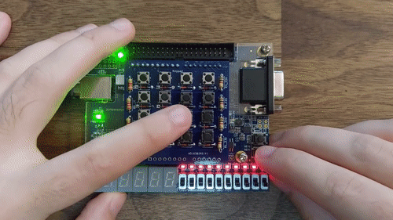
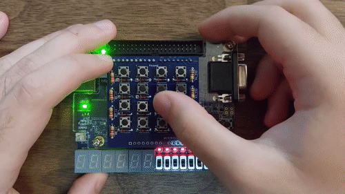
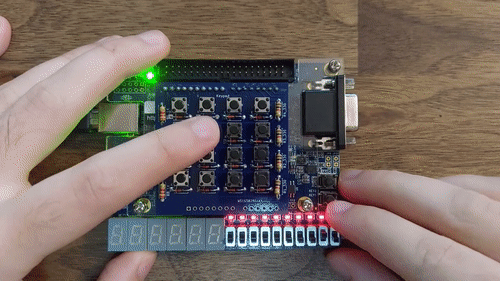
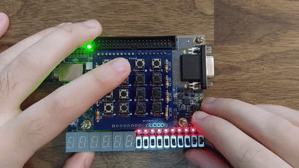
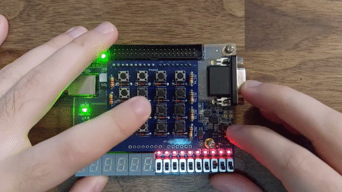
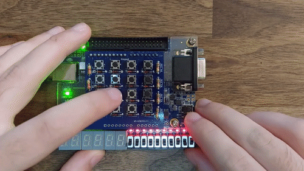

# Calculator

Calculator designed to handle up to many standard ALU operations including adding, subtracting, multiplying, dividing, and shifting. Operands can be accepted as 32-bit values from -2147483648 to 2147483647 along with a similar operation range. Anywhere outside this range may result in unexpected behavior including overflow.

---

## Repository Structure
The repository is organized as follows:

- `Calculator/`: Contains calculator project and verilog for RTL.
- `Documentation/`: Holds images and visual assets related to the project.

---

## Features

### Add

### Subtract

### Multiply

### Divide

### LSL, ASL

### LSR, ASR

### Scroll (HEX10 - HEX0)

---

## License
This is published under the [MIT License](https://opensource.org/licenses/MIT).

